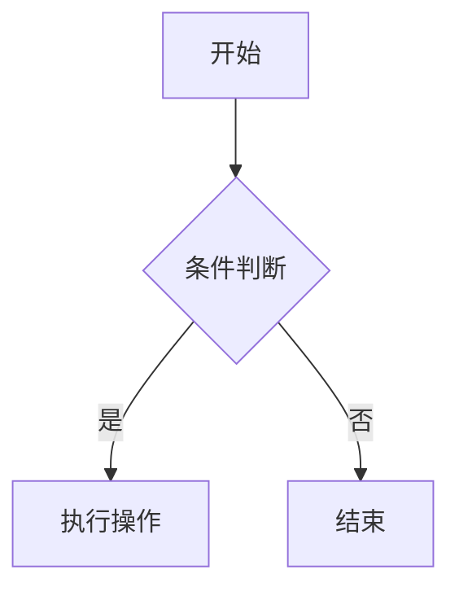

---
# ✨ Markdown 写作指南（升级版）

<div align="center">
  
  <p style="font-size:1.3em;color:#4a6baf;margin:5px 0 25px">
    <span style="display:inline-block;margin:0 10px">🎨</span> 
    文字设计的艺术 
    <span style="display:inline-block;margin:0 10px">🖋️</span>
  </p>
</div>
---

## 一、🔧核心语法工坊

### 1. 📐文档架构

#### 🧩 子节标题（补充）
除了基本的 `#` 标题系统，还可以使用锚点跳转功能，方便长文档导航：

```markdown
[点击跳转到本节](#子节标题)
```

也可以手动添加 ID 锚点（适用于支持 HTML 的 Markdown 解析器）：
```html
<h3 id="custom-id">自定义ID标题</h3>
```

#### 🔄 多种换行方式
- 行尾加两个空格 + 回车：`→  `
- 使用 HTML `<br>` 标签：`第一行<br>第二行`
- 在代码块中保留原格式即可

---

### 2. 🔤列表进阶

#### 🪄 嵌套列表
```markdown
1. 主任务
   - 子任务 A
   - 子任务 B
2. 次要任务
   * 可选任务 1
   * 可选任务 2
```

#### ✅ 待办事项清单（GitHub 风格）
```markdown
- [x] 已完成事项
- [ ] 未完成事项
```

---

### 3. 🧮数学公式

如果你使用的是 Obsidian、Typora 或 Jupyter Notebook 等支持 LaTeX 的编辑器，可以用如下方式插入数学公式：

```markdown
这是一个内联公式 $E = mc^2$

这是居中公式：
$$
\int_{-\infty}^\infty e^{-x^2} dx = \sqrt{\pi}
$$
```

---

## 二、🎨 文字化妆间

### 1. 🖍️ 颜色与高亮（仅限支持 HTML 的解析器）

虽然 Markdown 不直接支持颜色，但你可以嵌入 HTML 来实现文字高亮：

```html
<span style="color:red">红色警告</span>  
<span style="background-color:yellow">重点标记</span>
```

### 2. 💼 自定义字体（CSS+HTML）

在网页导出或 HTML 编辑器中，可设置字体：

```html
<p style="font-family:'Segoe UI', sans-serif; font-size:16px;">
  这是一段定制字体的文字。
</p>
```

---

### 3. 🧠 引用风格增强

除了基础引用，还可以加上作者信息和图标：

```markdown
> 🧑‍🏫 “知识不是力量，而是潜能。”  
> —— Peter Drucker
```

---

## 三、📊 数据可视化

### 1. 📊 图表绘制（Mermaid.js）

使用 Mermaid 可以在 Markdown 中创建流程图、甘特图、序列图等。



### 2. 📈 表格样式增强（带条纹背景）

使用 HTML 表格并配合 CSS 实现更美观的表格：

```html
<table style="width:100%; border-collapse: collapse;">
  <tr style="background-color:#f2f2f2">
    <th>产品</th><th>价格</th><th>库存</th>
  </tr>
  <tr>
    <td>MacBook Pro</td><td>$2499</td><td>5</td>
  </tr>
</table>
```

---

## 四、🖼️ 媒体画廊

### 1. 🖼️ 图片响应式排版

让图片在不同设备下自动缩放：

```html

```

### 2. 📹 视频嵌入进阶

部分平台支持 iframe 插入视频：

```html
<iframe width="560" height="315"
  src="视频.mp4"
  frameborder="0"
  allowfullscreen>
</iframe>
```

---

## 五、🔮 高级魔法

### 1. 📦 导出与转换

使用 Pandoc 可将 Markdown 转换为 PDF、Word、HTML、EPUB 等格式：

```bash
pandoc input.md -o output.pdf
```

推荐参数组合：
```bash
pandoc --pdf-engine=xelatex -V mainfont="思源黑体" input.md -o output.pdf
```

### 2. 🧰 插件生态（Obsidian 推荐）

| 插件名       | 功能描述     |
| --------- | -------- |
| Dataview  | 查询笔记中的数据 |
| Templater | 快捷模板插入   |
| Kanban    | 看板视图管理任务 |
| Graph     | 显示知识网络图  |

### 3. 📁 文件结构优化建议

```bash
my-project/
├── notes/
│   ├── intro.md
│   └── advanced.md
├── assets/
│   ├── logo.png
│   └── diagrams/
└── README.md
```

---

## 六、⚡ 高效写作技巧

### 1. 🧠 思维导图式写作法

先写大纲，再填充细节，最后润色。例如：

```markdown
# 项目计划书

## 1. 背景与目标
## 2. 市场分析
## 3. 技术方案
## 4. 时间规划
## 5. 风险评估
```

### 2. 📝 分段写作策略

每次只专注一个模块，避免思维跳跃导致效率下降。

---

## 七、📦 专业工具箱

| 工具名      | 功能说明                     | 特点                         |
|-------------|------------------------------|------------------------------|
| Typora      | 所见即所得 Markdown 编辑器   | 美观简洁，适合初学者         |
| Obsidian    | 知识图谱型笔记工具           | 支持插件，适合深度用户       |
| VS Code     | 支持 Markdown 的 IDE         | 强大灵活，适合开发者         |
| Mermaid Live Editor | 在线图表生成器       | 可视化编辑流程图、时序图等   |

---

<footer align="center" style="margin-top:50px;color:#777;font-size:0.9em">
🔄 最后更新: {{date:YYYY-MM-DD}}  
📮 使用 ❤️ + ✨ 制作  
</footer>

---
