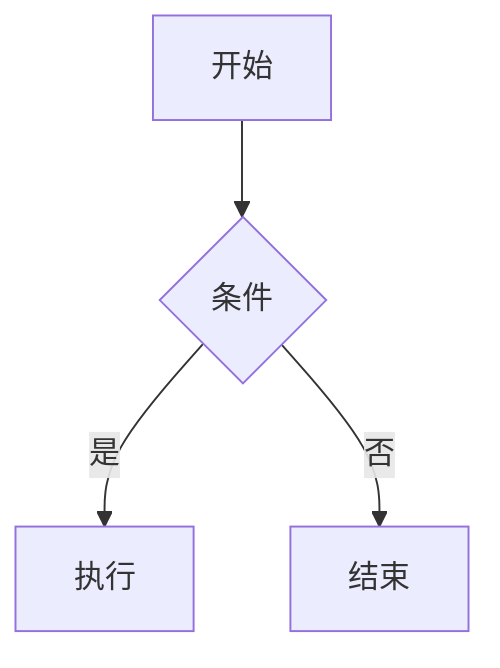
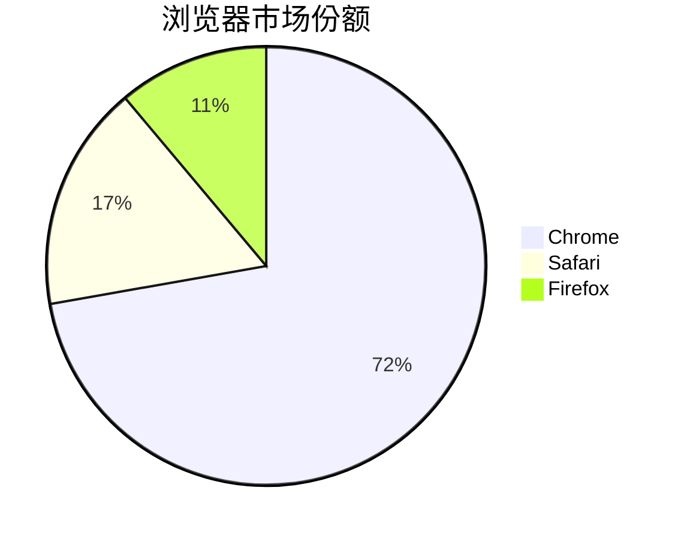

# 📝 Markdown 文本编写教程


## 目录
- [基础语法](#基础语法)
- [文本格式化](#文本格式化)
- [高级功能](#高级功能)
- [美化技巧](#美化技巧)
- [工具推荐](#工具推荐)

---

## 1️⃣ 基础语法

### 标题
```markdown
# H1 标题
## H2 标题
### H3 标题
#### H4 标题
##### H5 标题
###### H6 标题
```

### 段落与换行
- 普通段落：直接输入文字，**空一行**开始新段落
- 强制换行：行尾添加两个空格  
  （像这样→）  

### 分隔线
```markdown
---
或
***
或
___
```

---

## 2️⃣ 文本格式化

### 文字样式
| 样式 | 语法 | 效果 |
|------|------|------|
| 加粗 | `**文本**` 或 `__文本__` | **示例** |
| 斜体 | `*文本*` 或 `_文本_` | *示例* |
| 删除线 | `~~文本~~` | ~~示例~~ |
| 高亮 | `==文本==` (部分支持) | ==示例== |
| 组合 | `**_组合_**` | **_示例_** |

### 引用
```markdown
> 一级引用
>> 嵌套引用
>>> 三级引用
```

效果：
> 这是一个优雅的引用  
> 就像纸质书中的标注

---

## 3️⃣ 高级功能

### 表格（对齐优化）
```markdown
| 项目       | 价格    | 数量 |
|------------|:-------:|-----:|
| MacBook    | $1499   | 5    |
| iPad       | $799    | 10   |
| 对齐方式   | 居中对齐| 右对齐 |
```

效果：

| 项目       | 价格    | 数量 |
|------------|:-------:|-----:|
| MacBook    | $1499   | 5    |
| iPad       | $799    | 10   |

### 代码块
````markdown
```python
def hello_world():
    print("Hello, Markdown!")
    
# 支持语法高亮
```
````

### 任务列表
```markdown
- [x] 完成教程
- [ ] 添加示例
- [ ] 发布文章
```

---

## 4️⃣ 美化技巧

### 多彩提示框
```markdown
> 💡 **提示**：这是提示样式  
> ⚠️ **注意**：这是警告样式  
> ❗ **警告**：这是重要警告  
```

效果：
> 💡 **提示**：Markdown 兼容性因解析器而异  
> 🌈 **美化**：使用 emoji 增加可读性  

### 折叠内容
<details>
<summary>点击展开高级技巧</summary>

```markdown
隐藏的内容...
表格、代码等都可以放在这里
```
</details>

### 流程图（需扩展支持）
````markdown

````

---

## 🔧 5️⃣ 高级排版控制（扩展语法）

### 多级列表嵌套
```markdown
1. 一级列表
   - [ ] 二级任务列表
     + 三级无序列表
       * [x] 四级混合列表
   ```python
   # 列表内嵌套代码块（需缩进）
   print("Obsidian支持此语法")
```
效果：
1. 一级列表
   - [ ] 二级任务列表
     + 三级无序列表
       * [x] 四级混合列表
       ```python
       # 列表内嵌套代码块
       print("Obsidian支持此语法")
       ```

---

## 🧩 6️⃣ 跨文档引用系统

### 条件分页（Pandoc扩展）
````markdown
```{=markdown}
<!-- 仅在PDF输出时显示 -->
::: {.warning}
此内容仅出现在导出PDF时
:::
```
````

### 文献引用（学术写作）
```markdown
根据[@cite2023, p.45]的研究，Markdown的扩展性...

[^1]: 这是脚注内容

参考文献：
- @cite2023  《Markdown权威指南》, 2023
```

---

## 🖇️ 7️⃣ 动态内容嵌入

### 实时表格（Dataview插件示例）
````markdown
```dataview
TABLE file.mtime AS "修改时间", rating AS "评分"
FROM "知识库/项目"
WHERE status = "进行中"
SORT rating DESC
```
````

### 数学公式（LaTeX支持）
```markdown
行内公式：$E=mc^2$

块级公式：
$$
\begin{bmatrix}
1 & 0 \\
0 & 1
\end{bmatrix}
$$
```

---

## 🎛️ 8️⃣ 元数据控制

### Frontmatter配置
```yaml
---
title: 高级Markdown指南
date: 2025-06-24
tags: [教程, 技术]
cssclass: fancy-theme
---
```

### 条件渲染（Obsidian Advanced插件）
````markdown
%% 仅编辑器内可见的注释 %%

::: {.callout-note}
**平台特定内容**
<!-- 仅当vault名称包含"工作"时显示 -->
```query
{{VALUE:[[vault]]}} 包含 "工作" ? "[[工作流程]]" : "[[通用流程]]"
```
:::
````

---

## 🛠️ 9️⃣ 自动化技巧

### 模板变量
```markdown
{{date:YYYY-MM-DD}}  <!-- 自动插入当前日期 -->
{{title}}           <!-- 当前文档标题 -->
```

### 正则替换标记
```markdown
<!-- 用sed等工具批量处理时使用的标记 -->
{{replace_me::新内容}}
```

---

## 📐 10️⃣ 排版黑科技

### 分栏布局（CSS注入）
````markdown
<div style="column-count: 2; column-gap: 2em;">
左边内容...

右边内容...
</div>
````

### 悬停提示（HTML扩展）
```markdown
<abbr title="这是悬停提示">鼠标移到我身上</abbr>
```

---

## ⚙️ 11️⃣ 调试与优化

### 语法验证工具
```bash
# 使用markdownlint检查
mdl -r ~MD013,~MD029 your_file.md
```

### 性能优化
```markdown
[巨型表格优化技巧]：
<!-- 将超过100行的表格拆分为代码块引用 -->
```csv
1,2,3
4,5,6
```
```

---

## 🌐 12️⃣ 跨平台兼容方案

### 差异处理
````markdown
<!-- GitHub和Obsidian的差异化内容 -->
```{platform="github"}

```

```{platform="obsidian"}
[[仅Obsidian显示的链接]]
```
````

---

> 💎 **专业建议**：  
> 1. 复杂文档建议配合 `Pandoc` 或 `Quarto` 工具链使用  
> 2. 学术写作推荐 `Zotero + Better BibTeX` 管理引用  
> 3. 团队协作可使用 `Git + Markdown Conflict Resolver` 解决合并冲突  

附：扩展语法支持检查表
| 功能               | Obsidian | VS Code | GitHub |
|--------------------|----------|---------|--------|
| Mermaid流程图      | ✅       | ✅      | ✅     |
| Dataview查询       | ✅       | ❌      | ❌     |
| LaTeX公式          | ✅       | ✅      | ✅     |
| 动态变量           | ✅       | ❌      | ❌     |

需要更具体的哪方面深度扩展？可以告诉我您的使用场景（学术/技术/笔记等），我会提供针对性方案。

在 Markdown 中插入外部多媒体内容需要根据不同媒体类型采用不同语法，以下是详细指南：

---

### **1. 插入外部图片**
#### 基础语法（通用）
```markdown

```
- 示例：
  ```markdown
  
  ```

#### 高级控制（HTML扩展）
```markdown

```

---

### **2. 插入网络视频**
#### 通用方案（HTML嵌入）
```markdown
<video controls width="100%">
    <source src="视频URL.mp4" type="video/mp4">
    您的浏览器不支持视频标签
</video>
```

#### 平台专用嵌入（以YouTube为例）
```markdown
[](https://www.youtube.com/watch?v=视频ID)
```

---

### **3. 插入音频文件**
```markdown
<audio controls>
    <source src="音频URL.mp3" type="audio/mpeg">
    您的浏览器不支持音频元素
</audio>
```

---

### **4. 插入PDF/Office文档**
#### 直接链接
```markdown
[下载PDF手册](文档URL.pdf)
```

#### 嵌入式预览（需平台支持）
````markdown
```pdf
https://example.com/doc.pdf
width: 100%
height: 500px
```
````

---

### **5. 插入网页嵌入内容**
#### iframe嵌入
```markdown
<iframe src="网页URL" 
        width="100%" 
        height="400"
        frameborder="0">
</iframe>
```

---

### **6. 插入动态内容**
#### 可交互图表（需Mermaid支持）
````markdown

````

---

### **⚠️ 重要注意事项**
1. **URL稳定性**：
   - 建议使用永久链接（如GitHub Raw/CDN链接）
   - 避免使用可能失效的临时链接

2. **隐私与安全**：
   ```markdown
   <!-- 禁用外部资源跟踪 -->
   
   ```

3. **平台差异**：
   | 功能         | Obsidian | GitHub | 主流CMS |
   |--------------|----------|--------|---------|
   | 直接视频嵌入 | ❌       | ❌     | ✅      |
   | Mermaid图表  | ✅       | ✅     | ❌      |

4. **性能优化**：
   ```markdown
   <!-- 懒加载图片 -->
   
   ```

---

### **🎯 最佳实践建议**
1. **图床服务推荐**：
   - 免费：Imgur、GitHub Issues
   - 付费：七牛云、Cloudinary

2. **视频处理技巧**：
   ```markdown
   <!-- 使用缩略图+链接组合 -->
   [](video.mp4)
   ```

3. **学术写作专用**：
   ```latex
   \includegraphics[width=0.5\textwidth]{图片URL}
   ```